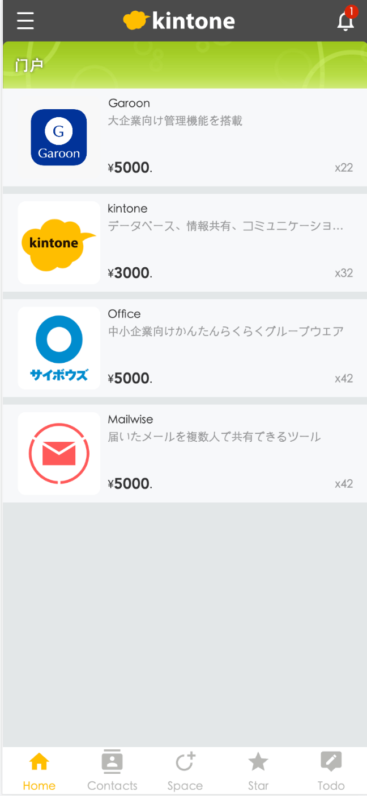

# vite-plugin-kintone-dev

[](https://www.npmjs.com/package/vite-plugin-kintone-dev)


[English](https://github.com/GuSanle/vite-plugin-kintone-dev/blob/main/README.md) | [日本語](https://github.com/GuSanle/vite-plugin-kintone-dev/blob/main/README.ja.md) ｜ 简体中文

这是一个 vite 插件，让你可以使用 vite 来进行 kintone 开发。我们知道 vite 使用 esm 来进行模块加载，而 kintone 上传自定义 js 时无法指定使用 esm 来加载。通过这个插件，能让你在本地开发时使用 esm 模块加载你的代码，实现 vite 构建。通过 hmr，让你的开发体验快如闪电。

## Disclaimer

この OSS は、私個人の著作物であり、サイボウズ株式会社、その他、私の所属する組織とは一切関係ありません。

This OSS is my own personal work and does not have any relationship with Cybozu Inc. or any other organization which I belong to.

## Install

```sh
# yarn
yarn add -D vite-plugin-kintone-dev
# npm
npm i -D vite-plugin-kintone-dev
# pnpm
pnpm add -D vite-plugin-kintone-dev
```

## Configuration

第一次启动时，会自动检查你的 env 文件的设置模版。如果没有配置，会启动命令行交互，让你输入配置信息。同时自动更新你的 env 文件。  
如果你的 env 文件设置有误，可以自行去修改。
（serve 模式下为".env.development"文件, build 模式下为".env.production"文件）

## Usage

```ts
// vite.config.ts
import { defineConfig } from "vite";
import kintoneDev from "vite-plugin-kintone-dev";

export default defineConfig({
  plugins: [
    kintoneDev(),
  ]
});
```

## Optional Parameters

构建时，希望指定文件名，请加上参数{outputName:"xxx"}，希望自动上传到 kintone，请加上参数{upload:true}。

```ts
kintoneDev({
  outputName: "mobile",
  upload: true
})
```

vite dev启动后，会在kintone的自定义设置页面自动上传"vite_plugin_kintone_dev_module_hack.js"脚本。
vite build时，会删除这段js脚本。并生成build后的js文件。

## Vite 6 支持
本插件现已支持Vite 6，提供了更好的性能和错误处理。所有必要的服务器配置（host、cors）都会由插件自动添加，因此你不需要手动设置它们。

## Example

kintone mobile demo:  
**React + TypeScript + Vite + kintone + material-ui**  
example: [kintone mobile custom demo(react)](https://github.com/GuSanle/kintone-vite-mui-demo)

**kintone mobile custom demo (vite4 + vue3 + vant4 + typescript)**  
  
example: [kintone mobile custom demo(vue)](https://github.com/GuSanle/kintone-mobile-custom-demo)

**kintone + vue + vite**  
example: [vue-kintone-vite-demo](https://github.com/GuSanle/vite-plugin-kintone-dev/tree/main/example/vue-kintone-vite-demo)

**kintone + react + vite**  
example: [react-kintone-vite-demo](https://github.com/GuSanle/vite-plugin-kintone-dev/tree/main/example/react-kintone-vite-demo)

## Note

如果开发时遇到[事件句柄的注册时机](https://cybozudev.kf5.com/hc/kb/article/1434396) 问题，
可以尝试在使用 kintone 事件后挂载后，使用如下代码解决问题。  
（构建时，可以删除，因为构建时，不再使用 esm 模式，不存在异步加载问题。）  
src/main.ts 的示例：

```ts
import { createApp } from "vue";
import App from "./App.vue";

kintone.events.on("app.record.detail.show", (event) => {
  const app = createApp(App);
  app.mount(kintone.app.record.getHeaderMenuSpaceElement()!);
  return event;
});

//通过手动执行kintone事件，来解决异步事件执行时机问题
const event = new Event("load");
// @ts-ignore
cybozu.eventTarget.dispatchEvent(event);
```

## 静态资源处理

在开发Kintone应用时，正确处理SVG图标等静态资源非常重要。与Webpack不同，Vite使用的Rollup不具备允许直接内联资源的加载器。

### 推荐方法：

1. **SVG图标**：使用 [unplugin-icons](https://github.com/unplugin/unplugin-icons) 等插件将SVG作为Vue组件导入。

2. **大型图片**：使用外部URL方式导入。

### 配置示例：

```ts
// vite.config.ts
import Icons from 'unplugin-icons/vite'
import IconsResolver from 'unplugin-icons/resolver'
import Components from 'unplugin-vue-components/vite'
import { FileSystemIconLoader } from 'unplugin-icons/loaders'

export default defineConfig({
  plugins: [
    // ...其他插件
    
    // 自动导入组件
    Components({
      resolvers: [IconsResolver()],
    }),
    
    // 配置图标
    Icons({
      autoInstall: true,
      customCollections: {
        // 从assets目录加载自定义图标
        'my-icons': FileSystemIconLoader('./src/assets'),
      },
    }),
  ],
})
```

### 在组件中使用图标：

```vue
<script setup>
// 将SVG作为组件导入
import IconLogo from '~icons/my-icons/logo'

// 或者作为URL导入
import logoUrl from './assets/logo.svg'
</script>

<template>
  <!-- 作为组件使用 -->
  <IconLogo />
  
  <!-- 作为图片源使用 -->
  
</template>
```

查看示例项目获取完整实现。

## 开发

本项目使用 pnpm 工作区进行开发。推荐的工作流程是：

1. 克隆此仓库
2. 安装依赖：
   ```bash
   pnpm install
   ```
3. 在示例项目中设置环境变量：
   ```bash
   cd examples/vue-demo
   cp .env.sample .env.development
   # 编辑 .env.development 文件设置您的 Kintone 凭据
   ```
4. 启动开发服务器：
   ```bash
   # 从根目录
   pnpm dev
   ```


